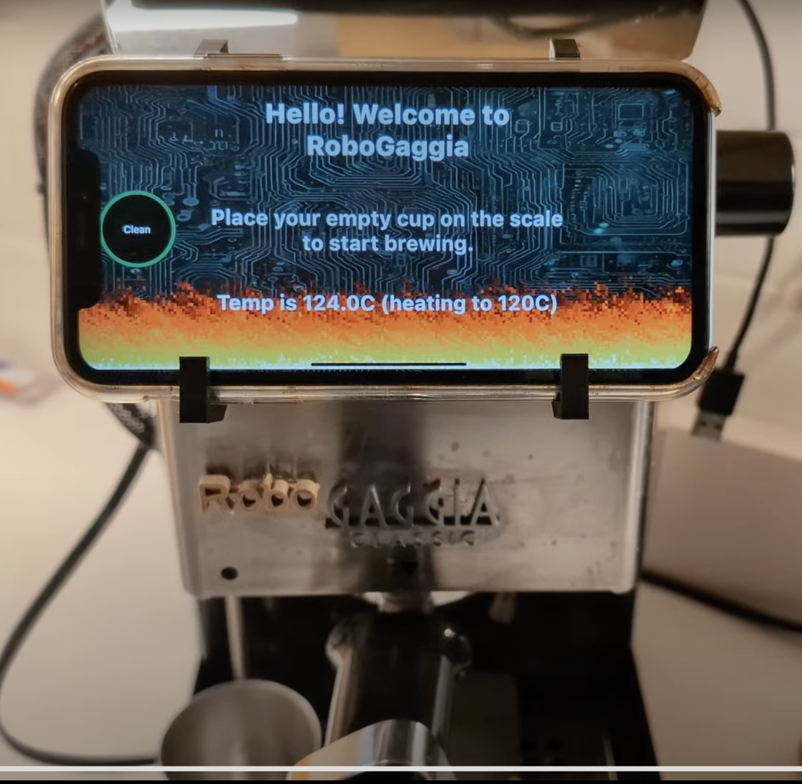

# Robo Gaggia Multiplatform UI

[Nick DiPatri](ndipatri@gmail.com)

[LinkedIn](https://www.linkedin.com/in/ndipatri/)

## RoboGaggia User Interface ##

This project provides a mobile-based user interface for the [Robo Gaggia](https://github.com/ndipatri/RoboGaggia) project.

The mobile device hangs on the front of Robo Gaggia and covers the original mechanical Gaggia brew and steam switches which are no longer needed.

Please see the [Robo Gaggia](https://github.com/ndipatri/RoboGaggia) project for details on how to hang the mobile device on the front of Robo Gaggia.

## Compose Multiplatform UI Framework

This Robo Gaggia Multiplatform UI (RGUI) project uses [Compose Multiplatform UI Framework](https://www.jetbrains.com/lp/compose-multiplatform/) technology to provide both an iOS and Android application.

## Bluetooth Low Energy (BLE) Communications

[Robo Gaggia](https://github.com/ndipatri/RoboGaggia) communicates with the RGUI mobile app using the Bluetooth Low Energy (BLE) "UART Service".

RoboGaggia emits **Live Telemetry** every 250 milliseconds that declares its state (e.g. Brewing, Steaming, etc.) as well as multiple sensor values.

To change state of Robo Gaggia, the RGUI mobile application sends one of two simple commands over the serial BLE connection: 'short' and 'long'.  This is because Robo Gaggia originally had a button and there were only two possible inputs.

## MQTT Testing Harness ##

It's impractical to develop this mobile application while talking over Bluetooth to the real Robo Gaggia (nobody loves making coffee THAT much), so I developed a test harness whereby this application can be configured to communicate with the desktop-based [Gaggia KMP Simulator](https://github.com/ndipatri/GaggiaKMPSimulator).

This simulator pretends that it is the Robo Gaggia device: it emits telemetry and changes state as commands are sent by the RGUI.

In order to use the GaggiaKMPSimulator, set the 'use.simulator' property in the [local.properties](local.properties) file of this project to 'true'.  The RGUI will, instead, use MQTT to communicate with the simulator.

Please see the [Gaggia KMP Simulator](https://github.com/ndipatri/GaggiaKMPSimulator) project for details on how to start the simulator and necessary local MQTT broker. 

